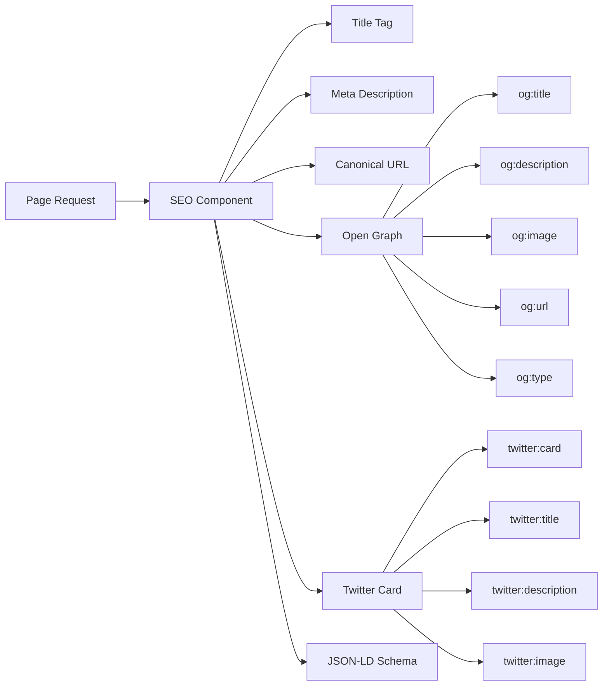
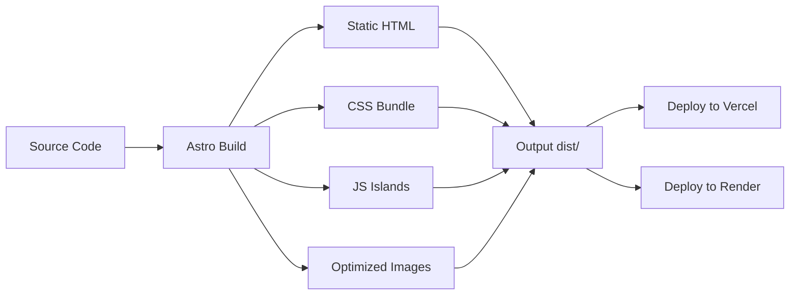
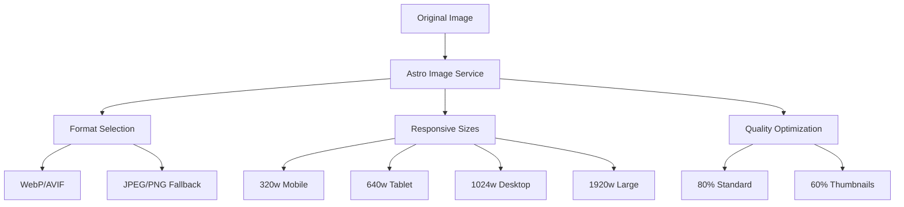
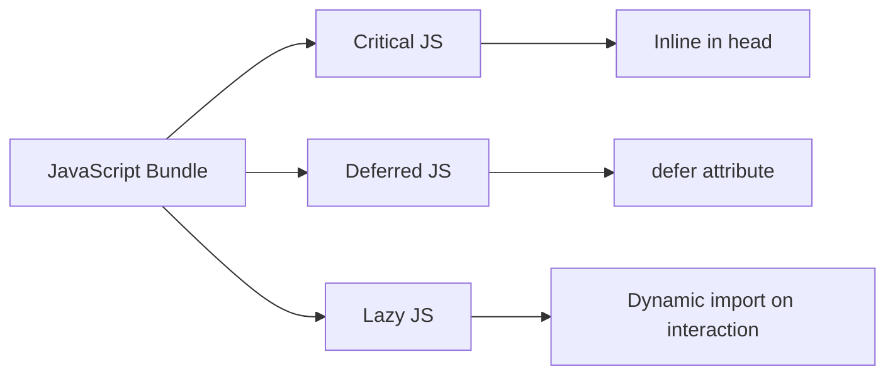

# BudgetTechIndia - Architecture Document

## Overview

BudgetTechIndia is a professional affiliate marketing website focused on helping Indian consumers discover the best budget tech products under ₹2000. This document outlines the complete technical architecture for building a fast, SEO-optimized, and maintainable website deployable on Vercel or Render.

---

## Table of Contents

1. [Tech Stack Recommendation](#1-tech-stack-recommendation)
2. [Project Structure](#2-project-structure)
3. [Component Architecture](#3-component-architecture)
4. [Data Structure](#4-data-structure)
5. [SEO Implementation Strategy](#5-seo-implementation-strategy)
6. [Styling Approach](#6-styling-approach)
7. [Build and Deployment Process](#7-build-and-deployment-process)
8. [Performance Optimization Strategy](#8-performance-optimization-strategy)
9. [Storage System Architecture](#9-storage-system-architecture)

---

## 1. Tech Stack Recommendation

### Primary Recommendation: Astro with React Islands

**Astro** is the recommended static site generator for BudgetTechIndia, with React for interactive components where needed.

### Justification

| Criteria | Astro | Next.js | Pure HTML/CSS/JS |
|----------|-------|---------|------------------|
| Build Speed | Excellent | Good | N/A |
| Bundle Size | Zero JS by default | Moderate | Minimal |
| SEO | Built-in optimization | Requires configuration | Manual |
| Content Management | Native Markdown/MDX | Requires setup | Manual |
| Learning Curve | Low | Moderate | Low |
| Vercel/Render Support | Native | Native | Native |
| Performance | Excellent | Good | Excellent |
| Maintainability | High | High | Low |

### Why Astro?

1. **Content-First Architecture**: Astro is designed specifically for content-rich websites like affiliate marketing sites, making it ideal for articles, reviews, and product comparisons.

2. **Zero JavaScript by Default**: Astro ships zero JavaScript by default, only hydrating interactive components when needed. This results in faster page loads and better Core Web Vitals.

3. **Islands Architecture**: Interactive elements like comparison tables, filters, or affiliate link tracking can use React components while the rest remains static.

4. **Native Markdown/MDX Support**: Articles and reviews can be written in Markdown with embedded components, making content creation efficient.

5. **Built-in SEO Features**: Automatic sitemap generation, RSS feeds, and excellent meta tag support out of the box.

6. **Vercel/Render Compatibility**: First-class deployment support on both platforms with zero configuration.

### Technology Stack Summary

```
Framework:        Astro 4.x
UI Components:    React 18.x (for interactive islands)
Styling:          Tailwind CSS 3.x
Content:          Markdown + MDX
Build Tool:       Vite (included with Astro)
Deployment:       Vercel (primary) / Render (secondary)
Package Manager:  pnpm (recommended for speed)
```

---

## 2. Project Structure

### Complete Folder/File Structure

```
budgettechindia/
├── public/
│   ├── favicon.ico
│   ├── robots.txt
│   ├── sitemap.xml (generated)
│   ├── images/
│   │   ├── products/          # Product images
│   │   ├── categories/        # Category thumbnails
│   │   ├── blog/             # Blog post images
│   │   └── og/               # Open Graph images
│   └── fonts/               # Self-hosted fonts
├── src/
│   ├── components/
│   │   ├── common/
│   │   │   ├── Header.astro
│   │   │   ├── Footer.astro
│   │   │   ├── Navigation.astro
│   │   │   ├── Logo.astro
│   │   │   ├── Button.astro
│   │   │   ├── Container.astro
│   │   │   └── Breadcrumb.astro
│   │   ├── seo/
│   │   │   ├── SEO.astro
│   │   │   ├── JsonLD.astro
│   │   │   └── OpenGraph.astro
│   │   ├── products/
│   │   │   ├── ProductCard.astro
│   │   │   ├── ProductGrid.astro
│   │   │   ├── ComparisonTable.tsx    # React island
│   │   │   ├── PriceTag.astro
│   │   │   ├── AffiliateLink.astro
│   │   │   └── RatingStars.astro
│   │   ├── content/
│   │   │   ├── ArticleCard.astro
│   │   │   ├── ArticleList.astro
│   │   │   ├── TableOfContents.astro
│   │   │   ├── Prose.astro
│   │   │   └── CTABox.astro
│   │   ├── legal/
│   │   │   ├── AffiliateDisclosure.astro
│   │   │   └── LegalPage.astro
│   │   └── home/
│   │       ├── Hero.astro
│   │       ├── FeaturedReviews.astro
│   │       ├── TopPicks.astro
│   │       └── CategoryShowcase.astro
│   ├── layouts/
│   │   ├── BaseLayout.astro
│   │   ├── ArticleLayout.astro
│   │   ├── CategoryLayout.astro
│   │   └── LegalLayout.astro
│   ├── pages/
│   │   ├── index.astro           # Home page
│   │   ├── reviews/
│   │   │   ├── index.astro       # Reviews listing
│   │   │   └── [slug].astro      # Individual review
│   │   ├── top-5/
│   │   │   ├── index.astro       # Top 5 lists
│   │   │   └── [slug].astro      # Individual top 5 list
│   │   ├── categories/
│   │   │   ├── index.astro       # All categories
│   │   │   ├── [category].astro   # Category page
│   │   │   └── [category]/[slug].astro
│   │   ├── blog/
│   │   │   ├── index.astro       # Blog listing
│   │   │   └── [slug].astro      # Individual blog post
│   │   ├── about.astro
│   │   ├── contact.astro
│   │   └── legal/
│   │       ├── privacy-policy.astro
│   │       ├── affiliate-disclosure.astro
│   │       └── terms-conditions.astro
│   ├── content/
│   │   ├── config.ts            # Content collection config
│   │   ├── reviews/             # Review articles in MDX
│   │   ├── top5-lists/          # Top 5 list articles
│   │   ├── blog/                # Blog posts
│   │   └── categories/          # Category descriptions
│   ├── data/
│   │   ├── products.json        # Product database
│   │   ├── categories.json      # Category metadata
│   │   ├── navigation.json      # Navigation structure
│   │   └── site-config.json     # Site-wide configuration
│   ├── styles/
│   │   ├── global.css
│   │   ├── typography.css
│   │   └── components.css
│   ├── utils/
│   │   ├── affiliate.ts         # Affiliate link helpers
│   │   ├── seo.ts               # SEO utilities
│   │   ├── formatting.ts        # Price, date formatting
│   │   └── helpers.ts           # General utilities
│   ├── hooks/
│   │   └── useAffiliate.ts      # Affiliate tracking hook
│   └── types/
│       └── index.ts             # TypeScript interfaces
├── .env.example
├── .gitignore
├── astro.config.mjs
├── tailwind.config.mjs
├── tsconfig.json
├── package.json
└── README.md
```

---

## 3. Component Architecture

### Component Categories

```mermaid
graph TD
    A[Components] --> B[Common]
    A --> C[SEO]
    A --> D[Products]
    A --> E[Content]
    A --> F[Legal]
    A --> G[Home]
    
    B --> B1[Header]
    B --> B2[Footer]
    B --> B3[Navigation]
    B --> B4[Button]
    B --> B5[Container]
    B --> B6[Breadcrumb]
    
    C --> C1[SEO Meta Tags]
    C --> C2[JSON-LD Schema]
    C --> C3[Open Graph]
    
    D --> D1[ProductCard]
    D --> D2[ProductGrid]
    D --> D3[ComparisonTable - React]
    D --> D4[PriceTag]
    D --> D5[AffiliateLink]
    D --> D6[RatingStars]
    
    E --> E1[ArticleCard]
    E --> E2[ArticleList]
    E --> E3[TableOfContents]
    E --> E4[Prose Wrapper]
    E --> E5[CTABox]
    
    F --> F1[AffiliateDisclosure]
    F --> F2[LegalPage]
    
    G --> G1[Hero]
    G --> G2[FeaturedReviews]
    G --> G3[TopPicks]
    G --> G4[CategoryShowcase]
```



### Core Components Specification

#### 1. Header Component
```
Purpose:        Site header with navigation and affiliate disclosure notice
Location:       src/components/common/Header.astro
Features:
  - Logo with alt text
  - Main navigation menu
  - Mobile hamburger menu
  - Sticky header on scroll
  - Subtle affiliate disclosure badge
Props:
  - currentPath: string (for active nav state)
```

#### 2. ProductCard Component
```
Purpose:        Display individual product in grid/list
Location:       src/components/products/ProductCard.astro
Features:
  - Product image with lazy loading
  - Product name and brief description
  - Price display in INR
  - Star rating
  - Buy Now CTA button with affiliate link
  - Hover effects
Props:
  - product: Product
  - showRating: boolean
  - showPrice: boolean
  - layout: grid | list
```

#### 3. ComparisonTable Component (React Island)
```
Purpose:        Interactive product comparison table
Location:       src/components/products/ComparisonTable.tsx
Features:
  - Sortable columns
  - Highlight best values
  - Mobile-responsive design
  - Affiliate links for each product
  - Expandable rows for details
Props:
  - products: Product[]
  - features: string[]
  - highlightBest: boolean
Hydration:      client:visible
```

#### 4. AffiliateLink Component
```
Purpose:        Trackable affiliate link wrapper
Location:       src/components/products/AffiliateLink.astro
Features:
  - Amazon Associates India link format
  - UTM parameter tracking
  - Rel attributes for SEO
  - Click tracking data attribute
  - Opens in new tab
Props:
  - url: string
  - productId: string
  - className: string
  - children: slot
```

#### 5. SEO Component
```
Purpose:        Comprehensive SEO meta tags
Location:       src/components/seo/SEO.astro
Features:
  - Title with site name suffix
  - Meta description
  - Canonical URL
  - Robots directives
  - Open Graph tags
  - Twitter Card tags
Props:
  - title: string
  - description: string
  - canonical: string
  - image: string
  - type: website | article
  - noindex: boolean
```

#### 6. JsonLD Component
```
Purpose:        Structured data for SEO
Location:       src/components/seo/JsonLD.astro
Features:
  - Organization schema
  - WebSite schema
  - Product schema
  - Article schema
  - BreadcrumbList schema
  - FAQPage schema
Props:
  - type: organization | website | product | article | breadcrumb | faq
  - data: object
```

#### 7. ArticleLayout Component
```
Purpose:        Layout for review/blog articles
Location:       src/layouts/ArticleLayout.astro
Features:
  - Extends BaseLayout
  - Table of contents sidebar
  - Breadcrumb navigation
  - Author info section
  - Last updated date
  - Related articles section
  - Affiliate disclosure banner
Props:
  - article: Article
  - breadcrumbs: Breadcrumb[]
```

---

## 4. Data Structure

### Content Storage Strategy

**Hybrid Approach**: Markdown/MDX for editorial content + JSON for structured product data.

### Product Data Structure (JSON)

```json
// src/data/products.json
{
  "products": [
    {
      "id": "boat-bassheads-100",
      "name": "boAt BassHeads 100",
      "slug": "boat-bassheads-100",
      "category": "bluetooth-earbuds",
      "brand": "boAt",
      "price": 399,
      "mrp": 999,
      "currency": "INR",
      "imageUrl": "/images/products/boat-bassheads-100.jpg",
      "affiliateUrl": "https://www.amazon.in/dp/B07BCH6JQK?tag=budgettechin-21",
      "asin": "B07BCH6JQK",
      "rating": 4.2,
      "reviewCount": 125000,
      "features": {
        "battery": "8 hours",
        "connectivity": "Wired 3.5mm",
        "driver": "10mm",
        "microphone": "Yes"
      },
      "pros": ["Great bass", "Value for money", "Durable build"],
      "cons": ["Wired only", "No noise cancellation"],
      "lastUpdated": "2026-02-15",
      "isActive": true
    }
  ]
}
```

### Category Data Structure (JSON)

```json
// src/data/categories.json
{
  "categories": [
    {
      "id": "bluetooth-earbuds",
      "name": "Bluetooth Earbuds",
      "slug": "bluetooth-earbuds",
      "description": "Best wireless earbuds under ₹2000",
      "imageUrl": "/images/categories/bluetooth-earbuds.jpg",
      "icon": "headphones",
      "priceRange": {
        "min": 299,
        "max": 1999
      },
      "productCount": 45,
      "featured": true
    }
  ]
}
```

### Article Frontmatter Schema (MDX)

```yaml
# src/content/reviews/boat-bassheads-100-review.mdx
---
title: "boAt BassHeads 100 Review - Best Budget Earphones Under 500"
description: "Complete review of boAt BassHeads 100 wired earphones. Sound quality, build, comfort, and value analysis for Indian buyers."
pubDate: 2026-02-15
updatedDate: 2026-02-15
author: "BudgetTechIndia Team"
category: "bluetooth-earbuds"
tags: ["earphones", "boat", "budget", "under-500"]
productId: "boat-bassheads-100"
image: "/images/blog/boat-bassheads-100-review.jpg"
type: "review"
schema: true
affiliateDisclosure: true
---

Article content here...
```

### TypeScript Interfaces

```typescript
// src/types/index.ts

interface Product {
  id: string;
  name: string;
  slug: string;
  category: string;
  brand: string;
  price: number;
  mrp: number;
  currency: 'INR';
  imageUrl: string;
  affiliateUrl: string;
  asin: string;
  rating: number;
  reviewCount: number;
  features: Record<string, string>;
  pros: string[];
  cons: string[];
  lastUpdated: string;
  isActive: boolean;
}

interface Category {
  id: string;
  name: string;
  slug: string;
  description: string;
  imageUrl: string;
  icon: string;
  priceRange: { min: number; max: number };
  productCount: number;
  featured: boolean;
}

interface Article {
  slug: string;
  title: string;
  description: string;
  pubDate: Date;
  updatedDate: Date;
  author: string;
  category: string;
  tags: string[];
  image: string;
  type: 'review' | 'top5' | 'blog';
  productId?: string;
  productIds?: string[];
}

interface SiteConfig {
  name: string;
  description: string;
  url: string;
  locale: 'en_IN';
  currency: 'INR';
  affiliateTag: string;
  social: {
    twitter?: string;
    facebook?: string;
    instagram?: string;
    youtube?: string;
  };
}
```

### Content Collections Configuration

```typescript
// src/content/config.ts
import { defineCollection, z } from 'astro:content';

const reviews = defineCollection({
  type: 'content',
  schema: z.object({
    title: z.string(),
    description: z.string(),
    pubDate: z.date(),
    updatedDate: z.date().optional(),
    author: z.string(),
    category: z.string(),
    tags: z.array(z.string()),
    productId: z.string(),
    image: z.string(),
    type: z.literal('review'),
    schema: z.boolean().default(true),
    affiliateDisclosure: z.boolean().default(true),
  }),
});

const top5Lists = defineCollection({
  type: 'content',
  schema: z.object({
    title: z.string(),
    description: z.string(),
    pubDate: z.date(),
    updatedDate: z.date().optional(),
    author: z.string(),
    category: z.string(),
    tags: z.array(z.string()),
    productIds: z.array(z.string()),
    image: z.string(),
    type: z.literal('top5'),
  }),
});

const blog = defineCollection({
  type: 'content',
  schema: z.object({
    title: z.string(),
    description: z.string(),
    pubDate: z.date(),
    updatedDate: z.date().optional(),
    author: z.string(),
    category: z.string().optional(),
    tags: z.array(z.string()),
    image: z.string(),
    type: z.literal('blog'),
  }),
});

export const collections = { reviews, top5Lists, blog };
```

---

## 5. SEO Implementation Strategy

### Meta Tags Implementation



### Title Tag Format

```
Pattern: {Page Title} | BudgetTechIndia - Best Tech Under ₹2000
Example: boAt BassHeads 100 Review | BudgetTechIndia - Best Tech Under ₹2000

Home: BudgetTechIndia - Best Budget Tech Products Under ₹2000 in India
Category: Best Bluetooth Earbuds Under ₹2000 | BudgetTechIndia
Article: {Article Title} | BudgetTechIndia
```

### Schema Markup Strategy

#### Organization Schema (All Pages)
```json
{
  "@context": "https://schema.org",
  "@type": "Organization",
  "name": "BudgetTechIndia",
  "url": "https://budgettechindia.com",
  "logo": "https://budgettechindia.com/images/logo.png",
  "sameAs": [
    "https://twitter.com/budgettechindia",
    "https://www.facebook.com/budgettechindia"
  ]
}
```

#### Product Schema (Review Pages)
```json
{
  "@context": "https://schema.org",
  "@type": "Product",
  "name": "boAt BassHeads 100",
  "image": "https://budgettechindia.com/images/products/boat-bassheads-100.jpg",
  "description": "Wired earphones with powerful bass...",
  "brand": {
    "@type": "Brand",
    "name": "boAt"
  },
  "offers": {
    "@type": "Offer",
    "url": "https://budgettechindia.com/reviews/boat-bassheads-100",
    "priceCurrency": "INR",
    "price": "399",
    "availability": "https://schema.org/InStock",
    "seller": {
      "@type": "Organization",
      "name": "Amazon India"
    }
  },
  "aggregateRating": {
    "@type": "AggregateRating",
    "ratingValue": "4.2",
    "reviewCount": "125000"
  }
}
```

#### Article Schema (Blog/Review Pages)
```json
{
  "@context": "https://schema.org",
  "@type": "Article",
  "headline": "boAt BassHeads 100 Review",
  "image": "https://budgettechindia.com/images/blog/boat-bassheads-100-review.jpg",
  "author": {
    "@type": "Organization",
    "name": "BudgetTechIndia Team"
  },
  "publisher": {
    "@type": "Organization",
    "name": "BudgetTechIndia",
    "logo": {
      "@type": "ImageObject",
      "url": "https://budgettechindia.com/images/logo.png"
    }
  },
  "datePublished": "2026-02-15",
  "dateModified": "2026-02-15"
}
```

#### FAQPage Schema (Top 5 Lists)
```json
{
  "@context": "https://schema.org",
  "@type": "FAQPage",
  "mainEntity": [
    {
      "@type": "Question",
      "name": "Which are the best Bluetooth earbuds under 2000?",
      "acceptedAnswer": {
        "@type": "Answer",
        "text": "The top 5 Bluetooth earbuds under ₹2000 are..."
      }
    }
  ]
}
```

#### BreadcrumbList Schema
```json
{
  "@context": "https://schema.org",
  "@type": "BreadcrumbList",
  "itemListElement": [
    {
      "@type": "ListItem",
      "position": 1,
      "name": "Home",
      "item": "https://budgettechindia.com"
    },
    {
      "@type": "ListItem",
      "position": 2,
      "name": "Reviews",
      "item": "https://budgettechindia.com/reviews"
    },
    {
      "@type": "ListItem",
      "position": 3,
      "name": "boAt BassHeads 100 Review",
      "item": "https://budgettechindia.com/reviews/boat-bassheads-100"
    }
  ]
}
```

### Sitemap Configuration

```javascript
// astro.config.mjs - sitemap integration
import { defineConfig } from 'astro/config';
import sitemap from '@astrojs/sitemap';

export default defineConfig({
  site: 'https://budgettechindia.com',
  integrations: [
    sitemap({
      changefreq: 'weekly',
      priority: 0.7,
      lastmod: new Date(),
      filter: (page) => !page.includes('/legal/'),
    }),
  ],
});
```

### Robots.txt Configuration

```
# public/robots.txt
User-agent: *
Allow: /

# Sitemap
Sitemap: https://budgettechindia.com/sitemap-index.xml

# Disallow admin/internal paths
Disallow: /api/
Disallow: /_astro/
```

### URL Structure

```
Home:              /
Reviews:           /reviews/
Individual Review: /reviews/[product-slug]
Top 5 Lists:       /top-5/
Individual List:   /top-5/[list-slug]
Categories:        /categories/
Category Page:     /categories/[category-slug]
Category Article:  /categories/[category-slug]/[article-slug]
Blog:              /blog/
Blog Post:         /blog/[post-slug]
About:             /about
Contact:           /contact
Legal Pages:       /legal/[page-slug]
```

---

## 6. Styling Approach

### Tailwind CSS Configuration

**Why Tailwind CSS?**
- Rapid development with utility classes
- Small production bundle (purges unused styles)
- Excellent responsive design utilities
- Consistent design system
- Great IDE support

### Color Palette

```javascript
// tailwind.config.mjs
export default {
  content: ['./src/**/*.{astro,html,js,jsx,md,mdx,svelte,ts,tsx}'],
  theme: {
    extend: {
      colors: {
        // Primary brand colors
        primary: {
          50: '#eff6ff',
          100: '#dbeafe',
          200: '#bfdbfe',
          300: '#93c5fd',
          400: '#60a5fa',
          500: '#3b82f6',  // Main primary
          600: '#2563eb',
          700: '#1d4ed8',
          800: '#1e40af',
          900: '#1e3a8a',
        },
        // Accent for CTAs
        accent: {
          400: '#fb923c',
          500: '#f97316',  // Main accent (orange)
          600: '#ea580c',
        },
        // Neutral grays
        neutral: {
          50: '#fafafa',
          100: '#f5f5f5',
          200: '#e5e5e5',
          300: '#d4d4d4',
          400: '#a3a3a3',
          500: '#737373',
          600: '#525252',
          700: '#404040',
          800: '#262626',
          900: '#171717',
        },
        // Success/positive
        success: {
          500: '#22c55e',
          600: '#16a34a',
        },
        // Warning
        warning: {
          500: '#eab308',
        },
      },
      fontFamily: {
        sans: ['Inter', 'system-ui', 'sans-serif'],
        heading: ['Poppins', 'Inter', 'sans-serif'],
      },
      fontSize: {
        'display': ['3rem', { lineHeight: '1.1', fontWeight: '700' }],
        'h1': ['2.25rem', { lineHeight: '1.2', fontWeight: '700' }],
        'h2': ['1.875rem', { lineHeight: '1.25', fontWeight: '600' }],
        'h3': ['1.5rem', { lineHeight: '1.3', fontWeight: '600' }],
        'h4': ['1.25rem', { lineHeight: '1.4', fontWeight: '600' }],
        'body': ['1rem', { lineHeight: '1.6' }],
        'small': ['0.875rem', { lineHeight: '1.5' }],
      },
      spacing: {
        '18': '4.5rem',
        '22': '5.5rem',
      },
      borderRadius: {
        'xl': '1rem',
        '2xl': '1.5rem',
      },
      boxShadow: {
        'soft': '0 2px 15px -3px rgba(0, 0, 0, 0.07), 0 10px 20px -2px rgba(0, 0, 0, 0.04)',
        'card': '0 1px 3px rgba(0, 0, 0, 0.08), 0 1px 2px rgba(0, 0, 0, 0.06)',
        'card-hover': '0 10px 40px -15px rgba(0, 0, 0, 0.15)',
      },
    },
  },
  plugins: [
    require('@tailwindcss/typography'),
    require('@tailwindcss/forms'),
  ],
};
```

### Typography Styles

```css
/* src/styles/typography.css */

/* Article prose styling */
.prose {
  @apply text-neutral-700;
}

.prose h2 {
  @apply font-heading text-h3 mt-10 mb-4 text-neutral-900;
}

.prose h3 {
  @apply font-heading text-h4 mt-8 mb-3 text-neutral-900;
}

.prose p {
  @apply mb-4 leading-relaxed;
}

.prose ul, .prose ol {
  @apply my-4 pl-6;
}

.prose li {
  @apply mb-2;
}

.prose a {
  @apply text-primary-600 hover:text-primary-700 underline;
}

.prose img {
  @apply rounded-xl shadow-soft my-6;
}

/* Comparison table styling */
.prose table {
  @apply w-full border-collapse my-6;
}

.prose th {
  @apply bg-neutral-100 text-left p-4 font-semibold text-neutral-800 border-b-2 border-neutral-200;
}

.prose td {
  @apply p-4 border-b border-neutral-100;
}

.prose tr:hover td {
  @apply bg-neutral-50;
}
```

### Component Styling Patterns

```css
/* src/styles/components.css */

/* CTA Button */
.btn-primary {
  @apply inline-flex items-center justify-center px-6 py-3 
         bg-accent-500 text-white font-semibold rounded-lg
         hover:bg-accent-600 transition-colors duration-200
         focus:outline-none focus:ring-2 focus:ring-accent-500 focus:ring-offset-2;
}

/* Product Card */
.product-card {
  @apply bg-white rounded-xl shadow-card hover:shadow-card-hover
         transition-shadow duration-300 overflow-hidden;
}

.product-card-image {
  @apply aspect-square object-cover w-full;
}

.product-card-content {
  @apply p-4;
}

/* Affiliate Disclosure Banner */
.affiliate-disclosure {
  @apply bg-neutral-100 border-l-4 border-primary-500 
         p-4 rounded-r-lg text-small text-neutral-600;
}

/* Price Tag */
.price-tag {
  @apply text-lg font-bold text-neutral-900;
}

.price-mrp {
  @apply text-sm text-neutral-400 line-through ml-2;
}

.price-discount {
  @apply text-sm text-success-600 font-semibold ml-2;
}
```

### Responsive Breakpoints

```
Mobile First Approach:
- Default: Mobile (< 640px)
- sm: 640px+ (Large phones)
- md: 768px+ (Tablets)
- lg: 1024px+ (Laptops)
- xl: 1280px+ (Desktops)
- 2xl: 1536px+ (Large screens)
```

---

## 7. Build and Deployment Process

### Build Pipeline



### Package.json Scripts

```json
{
  "scripts": {
    "dev": "astro dev",
    "start": "astro dev",
    "build": "astro build",
    "preview": "astro preview",
    "astro": "astro",
    "lint": "eslint src --ext .js,.ts,.astro",
    "lint:fix": "eslint src --ext .js,.ts,.astro --fix",
    "format": "prettier --write .",
    "typecheck": "astro check",
    "validate": "npm run typecheck && npm run lint"
  }
}
```

### Astro Configuration

```javascript
// astro.config.mjs
import { defineConfig } from 'astro/config';
import react from '@astrojs/react';
import tailwind from '@astrojs/tailwind';
import sitemap from '@astrojs/sitemap';
import mdx from '@astrojs/mdx';

export default defineConfig({
  site: 'https://budgettechindia.com',
  output: 'static',
  build: {
    inlineStylesheets: 'auto',
  },
  compressHTML: true,
  image: {
    service: {
      entrypoint: 'astro/assets/services/sharp',
    },
  },
  integrations: [
    react(),
    tailwind(),
    sitemap(),
    mdx(),
  ],
  vite: {
    build: {
      cssMinify: true,
      minify: 'esbuild',
    },
  },
});
```

### Vercel Deployment

```json
// vercel.json
{
  "buildCommand": "npm run build",
  "outputDirectory": "dist",
  "framework": "astro",
  "regions": ["bom1"],
  "headers": [
    {
      "source": "/(.*)",
      "headers": [
        {
          "key": "X-Content-Type-Options",
          "value": "nosniff"
        },
        {
          "key": "X-Frame-Options",
          "value": "DENY"
        },
        {
          "key": "X-XSS-Protection",
          "value": "1; mode=block"
        }
      ]
    },
    {
      "source": "/images/(.*)",
      "headers": [
        {
          "key": "Cache-Control",
          "value": "public, max-age=31536000, immutable"
        }
      ]
    }
  ]
}
```

### Render Deployment

```yaml
# render.yaml
services:
  - type: web
    name: budgettechindia
    env: static
    buildCommand: npm install && npm run build
    staticPublishPath: dist
    headers:
      - path: /images/*
        name: Cache-Control
        value: public, max-age=31536000, immutable
      - path: /*
        name: X-Content-Type-Options
        value: nosniff
```

### CI/CD Pipeline (GitHub Actions)

```yaml
# .github/workflows/deploy.yml
name: Deploy to Vercel

on:
  push:
    branches: [main]
  pull_request:
    branches: [main]

jobs:
  build-and-deploy:
    runs-on: ubuntu-latest
    steps:
      - uses: actions/checkout@v4
      
      - name: Setup Node.js
        uses: actions/setup-node@v4
        with:
          node-version: '20'
          cache: 'npm'
      
      - name: Install dependencies
        run: npm ci
      
      - name: Type check
        run: npm run typecheck
      
      - name: Lint
        run: npm run lint
      
      - name: Build
        run: npm run build
      
      - name: Deploy to Vercel
        uses: amondnet/vercel-action@v25
        with:
          vercel-token: ${{ secrets.VERCEL_TOKEN }}
          vercel-org-id: ${{ secrets.VERCEL_ORG_ID }}
          vercel-project-id: ${{ secrets.VERCEL_PROJECT_ID }}
          vercel-args: '--prod'
```

---

## 9. Storage System Architecture

### Overview

The application implements a dual storage system with support for both local JSON file storage and Firebase Firestore, providing flexibility for different deployment scenarios and scalability needs.

### Architecture Pattern

The storage system follows a **factory pattern** design, allowing the application to switch between storage implementations based on configuration.

#### Storage Types

1. **Local JSON File Storage (Default)**
   - Simple, lightweight solution
   - Files stored in `src/data/` directory
   - Products: `src/data/products.json`
   - Categories: `src/data/categories.json`
   - Content: `src/data/content.json`
   - Settings: `src/data/settings.json`
   - No external dependencies
   - Ideal for small to medium datasets and development

2. **Firebase Firestore Storage**
   - Cloud-based NoSQL database
   - Real-time synchronization
   - Automatic backup and redundancy
   - Scalable for large datasets
   - Requires Firebase project configuration

### Storage System Implementation

#### 1. Storage Interface (`src/utils/storage/index.ts`)

Defines the standard storage interface that all implementations must conform to:

```typescript
export interface StorageSystem {
  getAllProducts(): Promise<Product[]>;
  getProductById(id: string): Promise<Product | null>;
  getProductsByCategory(category: string): Promise<Product[]>;
  addProduct(product: Omit<Product, 'id'>): Promise<string | null>;
  updateProduct(id: string, product: Partial<Product>): Promise<boolean>;
  deleteProduct(id: string): Promise<boolean>;
  // ... other methods for categories, content, settings
  exportData(): Promise<string>;
  importData(data: string): Promise<boolean>;
  getStorageInfo(): StorageInfo;
}
```

#### 2. Factory Function

Selects the appropriate storage system based on configuration:

```typescript
export async function getStorageSystem(type?: StorageType): Promise<StorageSystem> {
  const storageType = type || (import.meta.env.PUBLIC_STORAGE_TYPE as StorageType) || 'local';
  
  switch (storageType) {
    case 'firebase':
      const { FirebaseStorage } = await import('./firebaseStorage');
      return new FirebaseStorage();
    case 'local':
    default:
      const { LocalStorage } = await import('./localStorage');
      return new LocalStorage();
  }
}
```

#### 3. Firebase Storage Implementation (`src/utils/storage/firebaseStorage.ts`)

Uses Firebase Firestore SDK to interact with the cloud database:

```typescript
export class FirebaseStorage implements StorageSystem {
  async getAllProducts(): Promise<Product[]> {
    const productsRef = collection(db, PRODUCTS_COLLECTION);
    const q = query(productsRef, orderBy('name', 'asc'));
    const snapshot = await getDocs(q);
    
    return snapshot.docs.map((doc) => ({
      id: doc.id,
      ...doc.data(),
    })) as Product[];
  }
  
  // ... other methods
}
```

#### 4. Local Storage Implementation (`src/utils/storage/localStorage.ts`)

Reads and writes data to local JSON files:

```typescript
export class LocalStorage implements StorageSystem {
  async getAllProducts(): Promise<Product[]> {
    const data = readJSONFile(PRODUCTS_FILE, { products: [] });
    return data.products || [];
  }
  
  async addProduct(product: Omit<Product, 'id'>): Promise<string | null> {
    const products = await this.getAllProducts();
    const newProduct: Product = {
      ...product,
      id: Date.now().toString(),
      lastUpdated: new Date().toISOString(),
    };

    products.push(newProduct);
    const success = writeJSONFile(PRODUCTS_FILE, { products });
    return success ? newProduct.id : null;
  }
  
  // ... other methods
}
```

### Configuration

Set the storage type in your `.env` file:

```env
# Use local JSON files (default)
PUBLIC_STORAGE_TYPE=local

# Or use Firebase Firestore
PUBLIC_STORAGE_TYPE=firebase
```

### Storage Features

#### Data Migration

The system supports data migration between storage systems:

```typescript
// Export data from current storage
const storage = await getStorageSystem();
const data = await storage.exportData();

// Import data into target storage
const targetStorage = await getStorageSystem('firebase');
const success = await targetStorage.importData(data);
```

#### Export/Import

Users can export data to JSON files for backup and import data from JSON files:

```typescript
// Export
const data = await storage.exportData();
const blob = new Blob([data], { type: 'application/json' });
const url = URL.createObjectURL(blob);
const a = document.createElement('a');
a.href = url;
a.download = `budgettechindia-data-${new Date().toISOString().split('T')[0]}.json`;
a.click();
URL.revokeObjectURL(url);

// Import
const file = e.target.files?.[0];
const reader = new FileReader();
reader.onload = async (e) => {
  const data = e.target?.result as string;
  const success = await storage.importData(data);
  if (success) {
    alert('Data imported successfully!');
    window.location.reload();
  }
};
reader.readAsText(file);
```

### Admin Panel Integration

The admin panel includes:

1. **Storage Selector Component** (`src/components/admin/StorageSelector.astro`)
   - Displays current storage system
   - Shows storage configuration status
   - Provides information about storage type

2. **Data Migration Component** (`src/components/admin/DataMigration.astro`)
   - Export data to JSON file
   - Import data from JSON file
   - Migrate data between storage systems
   - Batch operations

3. **Storage Settings Page** (`src/pages/admin/settings.astro`)
   - Storage system configuration
   - Data migration tools
   - System information
   - Environment variables display

### Usage in Application

Components and pages use the storage system by importing and calling the factory function:

```typescript
import { getStorageSystem } from '../../utils/storage';

const storageSystem = await getStorageSystem();
const products = await storageSystem.getAllProducts();
```

This ensures that all components are storage-agnostic and will work with any implementation that conforms to the `StorageSystem` interface.

---

## 8. Performance Optimization Strategy

### Core Web Vitals Targets

| Metric | Target | Strategy |
|--------|--------|----------|
| LCP (Largest Contentful Paint) | < 2.5s | Image optimization, preload critical assets |
| FID (First Input Delay) | < 100ms | Minimal JS, defer non-critical scripts |
| CLS (Cumulative Layout Shift) | < 0.1 | Reserve space for images, stable layouts |
| TTFB (Time to First Byte) | < 600ms | CDN, edge caching |

### Image Optimization



#### Image Implementation

```astro
---
// Using Astro's built-in image optimization
import { Image } from 'astro:assets';
import productImage from '../assets/products/earbuds.jpg';
---

<Image 
  src={productImage}
  alt="boAt BassHeads 100 Earphones"
  widths={[320, 640, 1024]}
  sizes="(max-width: 640px) 320px, (max-width: 1024px) 640px, 1024px"
  format="webp"
  loading="lazy"
/>
```

### Lazy Loading Strategy

```javascript
// Native lazy loading for images


// Intersection Observer for components
const observer = new IntersectionObserver((entries) => {
  entries.forEach(entry => {
    if (entry.isIntersecting) {
      entry.target.classList.add('visible');
    }
  });
}, { rootMargin: '50px' });
```

### Critical CSS Inlining

Astro automatically inlines critical CSS. Additional optimization:

```css
/* Critical above-fold styles inlined */
/* Non-critical styles loaded asynchronously */

/* Preload critical fonts */
<link rel="preload" href="/fonts/inter-var.woff2" as="font" type="font/woff2" crossorigin />
```

### Font Optimization

```html
<!-- Self-hosted fonts for performance -->
<link rel="preconnect" href="https://fonts.googleapis.com">
<link rel="preconnect" href="https://fonts.gstatic.com" crossorigin>
<link href="https://fonts.googleapis.com/css2?family=Inter:wght@400;500;600;700&family=Poppins:wght@600;700&display=swap" rel="stylesheet">

<!-- Or self-hosted -->
<style>
  @font-face {
    font-family: 'Inter';
    font-style: normal;
    font-weight: 400;
    font-display: swap;
    src: url('/fonts/inter-regular.woff2') format('woff2');
  }
</style>
```

### JavaScript Optimization



#### React Islands Hydration Strategy

```astro
---
// Only hydrate when visible
<ComparisonTable client:visible products={products} />

// Only hydrate on mobile
<MobileMenu client:media="(max-width: 768px)" />

// Only hydrate on user interaction
<ExpandableSection client:idle />
---
```

### Caching Strategy

```
# Cache Headers Configuration

# Static Assets (1 year)
/images/*       -> Cache-Control: public, max-age=31536000, immutable
/_astro/*       -> Cache-Control: public, max-age=31536000, immutable
/fonts/*        -> Cache-Control: public, max-age=31536000, immutable

# HTML Pages (1 hour, revalidate)
/*.html         -> Cache-Control: public, max-age=3600, stale-while-revalidate=86400

# API Routes (no cache)
/api/*          -> Cache-Control: no-store
```

### Bundle Size Budget

```
Resource              Budget
-----------------------------------------
HTML per page         < 50 KB
CSS total             < 30 KB
JavaScript total      < 100 KB
Images per page       < 500 KB
Total page weight     < 1 MB
```

### Performance Checklist

- [ ] Use Astro's built-in image optimization
- [ ] Implement lazy loading for below-fold images
- [ ] Use `loading="lazy"` for images
- [ ] Use `decoding="async"` for images
- [ ] Preload critical fonts
- [ ] Use `font-display: swap` for fonts
- [ ] Minimize React islands to essential interactive components
- [ ] Use `client:visible` for island hydration
- [ ] Enable Gzip/Brotli compression on server
- [ ] Implement service worker for offline support (optional)
- [ ] Use CDN for static assets
- [ ] Minimize third-party scripts
- [ ] Inline critical CSS
- [ ] Defer non-critical JavaScript

---

## Summary

### Key Architecture Decisions

| Decision | Choice | Rationale |
|----------|--------|-----------|
| Framework | Astro 4.x | Content-first, zero JS default, excellent SEO |
| UI Components | React (Islands) | Interactive components only where needed |
| Styling | Tailwind CSS | Rapid development, small bundle, responsive utilities |
| Content Storage | MDX + JSON | Editorial content in MDX, structured data in JSON |
| Deployment | Vercel | Edge network in India, excellent Astro support |
| Image Optimization | Astro Sharp | Built-in, automatic WebP/AVIF conversion |

### Performance Guarantees

- **LCP < 2.5s**: Achieved through static generation, image optimization, and CDN
- **FID < 100ms**: Minimal JavaScript with selective hydration
- **CLS < 0.1**: Stable layouts with reserved image space
- **Bundle Size < 100KB JS**: Zero JS by default, islands only for interactivity

### SEO Guarantees

- **Semantic HTML**: Proper heading hierarchy, ARIA labels
- **Schema Markup**: Organization, Product, Article, FAQPage, BreadcrumbList
- **Meta Tags**: Comprehensive Open Graph and Twitter Cards
- **Sitemap**: Auto-generated with proper priorities
- **URL Structure**: Clean, hierarchical, SEO-friendly

### Next Steps

1. Initialize Astro project with React and Tailwind integrations
2. Create base layouts and components
3. Set up content collections for reviews, top-5 lists, and blog
4. Implement product data structure
5. Build out pages and components
6. Configure deployment pipeline
7. Test Core Web Vitals and optimize

---

*Document Version: 1.0*
*Last Updated: 2026-02-15*
*Author: Architecture Team*